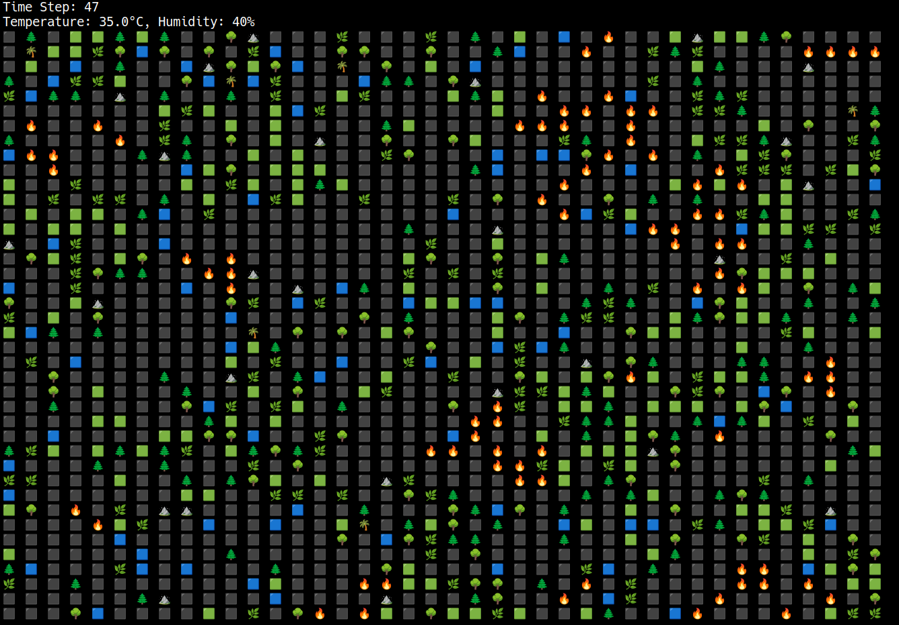
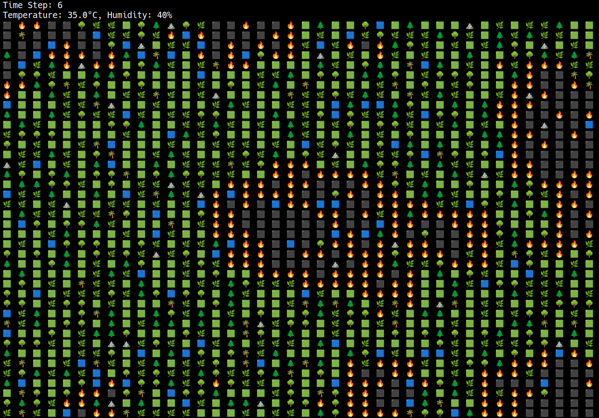

# Forest Fire Cellular Automata Simulation

A functional programming project written in Scala that simulates forest fire spread using cellular automata principles. This simulation models environmental factors including temperature, humidity, wind effects, and natural ecosystem dynamics.

## Features

- Real-time visual simulation with console display
- Cellular automata engine with probabilistic fire spread
- Environmental factors: temperature, humidity, and wind effects
- Natural ecosystem growth and regeneration cycles
- CSV data export for statistical analysis
- Functional programming implementation

## Quick Start

### Prerequisites
- Java 11 or higher
- SBT (Scala Build Tool)
- Terminal/Command prompt

### Installation

1. **Clone the repository**
   ```bash
   git clone git@github.com:szpy1950/ForestFire.git
   cd ForestFire
   ```

2. **Run the simulation**
   ```bash
   sbt run
   ```

## Understanding the Simulation




A youtube video is available here:

[ForestFire Simulation Video](https://youtu.be/tA5UnrfqJQI)

### Grid Elements
The simulation displays different elements using visual indicators:

| Element | Symbol | Description |
|---------|--------|-------------|
| Water | 🔵 | Cannot burn, helps extinguish nearby fires |
| Rock | ⛰️ | Cannot burn, acts as firebreak |
| Grass | 🟩 | Burns quickly (1 step) |
| Bush | 🌿 | Burns moderately (2 steps) |
| Small Tree | 🌳 | Burns slowly (3 steps) |
| Growing Tree | 🌲 | Burns slowly (4 steps) |
| Mature Tree | 🌴 | Burns very slowly (5 steps) |
| Fire | 🔥 | Active burning cell |
| Destroyed | ⬛ | Burned out area |

### Environmental Factors

**Temperature Effects:**
- Higher temperatures increase fire spread probability
- Increases spontaneous ignition chances
- Default: 35°C

**Humidity Effects:**
- Higher humidity reduces fire spread
- Helps extinguish existing fires
- Default: 40%

**Wind Effects:**
- Fire spreads faster in wind direction
- Currently set to East direction

### Ecosystem Dynamics

The simulation includes natural growth patterns:
- Grass can evolve into bushes or trees over time
- Destroyed areas slowly regenerate into vegetation
- Different vegetation types have varying burn characteristics
- Growth rates are probabilistic and configurable

## Configuration

### Basic Settings
Edit these values in the `main` function:

```scala
val gridSize = 20        // Size of the simulation grid
val maxSteps = 50        // Number of simulation steps
val temperature = 35.0   // Global temperature (°C)
val humidity = 0.4       // Global humidity (0.0-1.0)
```

### Forest Composition
Adjust vegetation distribution in `ForestConfig`:

```scala
val config = ForestConfig(
  water = 0.05,      // 5% water
  rock = 0.02,       // 2% rocks
  grass = 0.35,      // 35% grass
  bush = 0.25,       // 25% bushes
  smallTree = 0.15,  // 15% small trees
  growingTree = 0.13,// 13% growing trees
  tree = 0.05        // 5% mature trees
)
```

### Fire Behavior Parameters
Modify fire characteristics in `SimulationConstants`:

```scala
// Self-ignition probability
val baseSelfIgnitionChance = 0.0008

// Fire spread rates
val neighborIgnitionEffect = 0.8

// Growth rates
val grassToBushChance = 0.02
val bushToSmallTreeChance = 0.015
```

## Data Export

The simulation exports comprehensive data to `forest_fire_simulation.csv` with the following structure:

| Column | Description |
|--------|-------------|
| step | Time step number (0 to maxSteps) |
| x, y | Cell coordinates in the grid |
| cell_type | Vegetation type code (0-8) |
| temperature | Global temperature value |
| humidity | Global humidity value |

### Cell Type Codes
- 0: Water
- 1: Rock
- 2: Grass
- 3: Bush
- 4: Small Tree
- 5: Growing Tree
- 6: Mature Tree
- 7: On Fire
- 8: Destroyed

## Implementation Details

### Functional Programming Approach
- Immutable data structures for grid state
- Pure functions for state transitions
- Pattern matching for vegetation behavior
- Higher-order functions for grid operations

### Algorithm Features
- Probabilistic fire spread based on environmental conditions
- Self-ignition probability calculations
- Wind direction influence on fire propagation
- Humidity dependence
- Temperature influence
- Natural extinguishing mechanisms

## Troubleshooting

**Build Issues:**
```bash
# If main class not found
sbt "runMain ForestFire.SimpleForestFireSimulation"

# Clean and rebuild
sbt clean compile run
```

**Performance Tuning:**
- Adjust `Thread.sleep()` value to control display speed
- Modify grid size for different computational loads
- Change `maxSteps` to control simulation duration

## License

This project is available under the MIT License.
